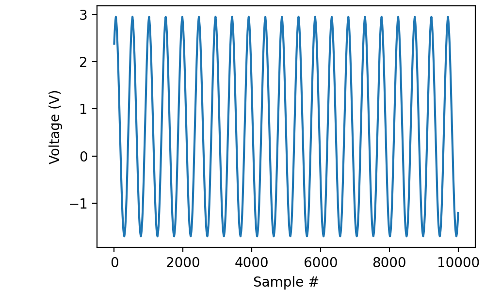
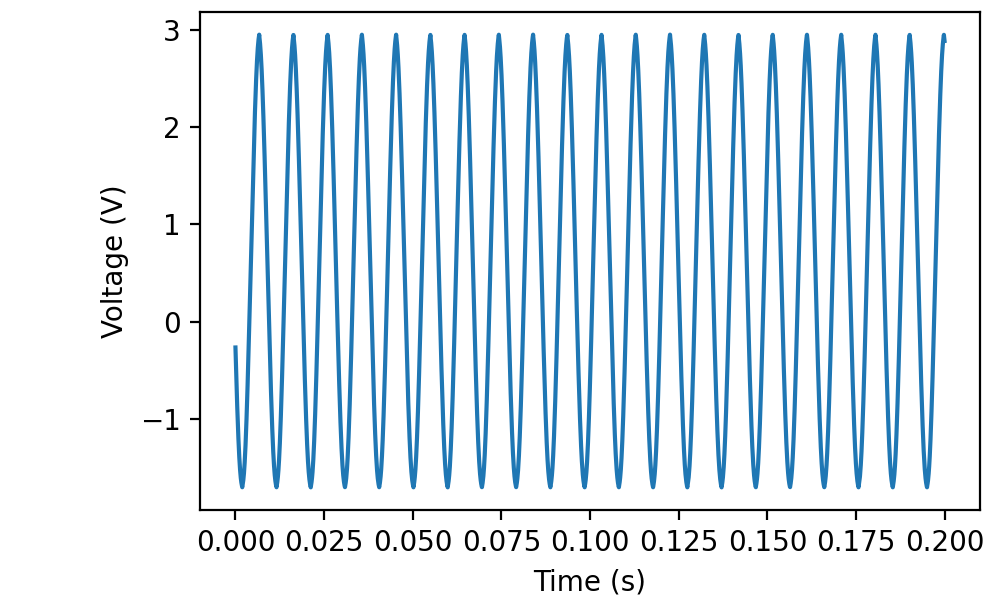
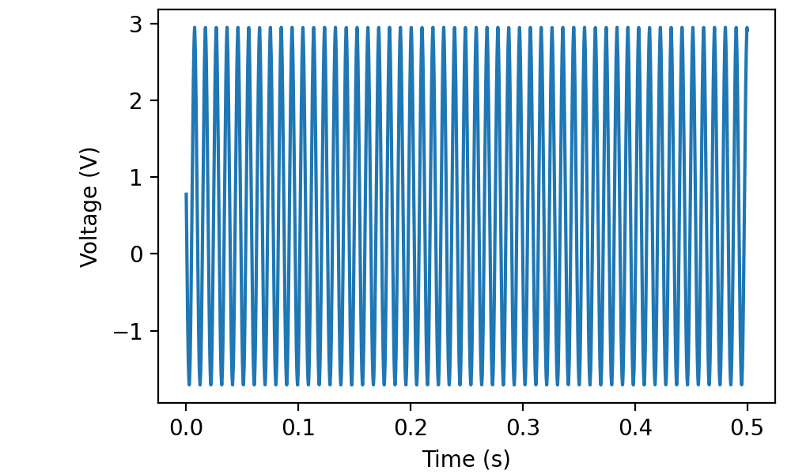
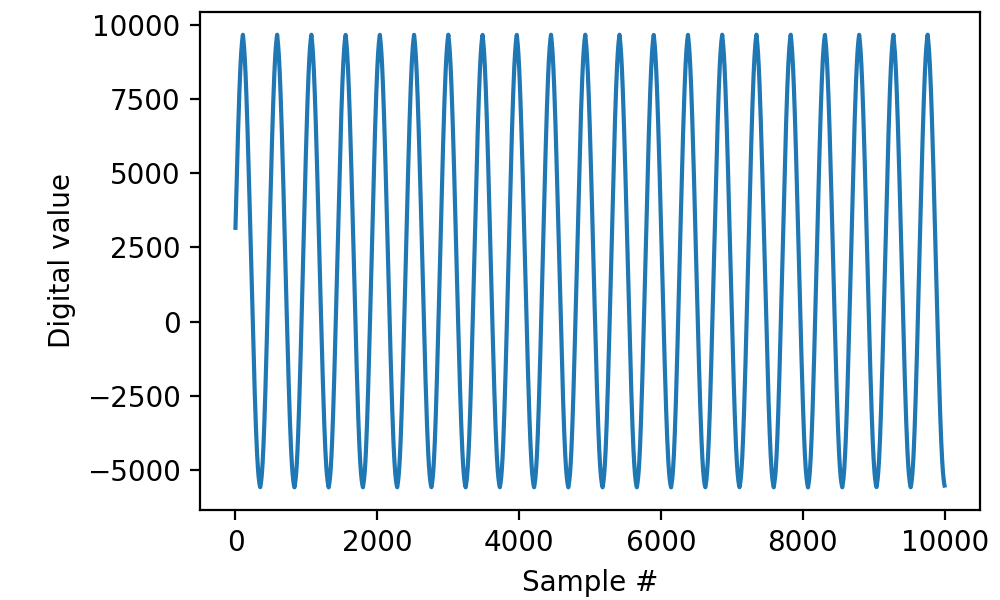

.. _cookbook-a1:

Recipes for recording from a single analog source
=================================================

The most basic use of picodaq
-----------------------------

Read 200 milliseconds worth of data from channel “ai0” with a sampling
frequency of 50 kilohertz and display the results using matplotlib:

.. literalinclude :: _static/code/cookbook/recipe_a1a.py

In this case, I had an approximately 100-Hz sinusoidal signal
connected to the input:

           
Retrieving timestamps
---------------------
           
The *read* function can also return timestamps along with your data:

.. literalinclude :: _static/code/cookbook/recipe_a1b.py

Of course, you could have reconstructed the timestamps yourself using
something like:

.. codeblock::

   times = np.arange(len(data)) / 50000

but the earlier form generalizes a little better, as we will see below.

Reading more data
-----------------

It is certainly possible to read a larger quantity of data with a
single call to *read*, but you may want to do some online processing
or show a progress bar.

.. literalinclude :: _static/code/cookbook/recipe_a1d.py

Notice that the timestamps do not restart from zero in each read frame.

Retrieving raw binary data
--------------------------

On occasion, mostly for debugging purposes, it may be useful to
retrieve raw binary data.

.. literalinclude :: _static/code/cookbook/recipe_a1c.py

           
