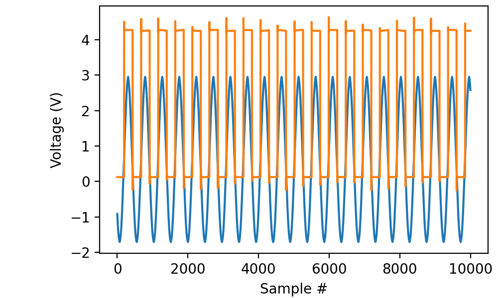
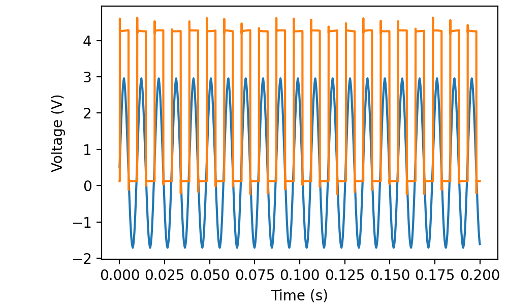

.. _cookbook-a2:

Recipes for recording from multiple analog sources
==================================================

Reading a short segment from two channels
-----------------------------------------

Read 200 ms worth of data from channels “ai0” and “ai1” with a
sampling frequency of 50 kilohertz and display the results using
matplotlib:

.. literalinclude :: _static/code/cookbook/recipe_a2a.py

(The “TTL” output from my cheap function generator isn’t very clean.)

The resulting ``data`` is a `T` × `C` array where `T` is the sample count and
`C` is the number of channels.

Retrieving time stamps
----------------------

.. literalinclude :: _static/code/cookbook/recipe_a2b.py

The ``times`` return value is still a simple `T`-vector.

Retrieving raw data
-------------------

Retrieving raw data from multiple channels is equally straightforward:

.. code-block::

    with AnalogIn(channels=[0, 1], rate=50*kHz) as ai:
        data = ai.read(200*ms, raw=True)

The result is a `T` × `C` array of 16-bit integers.

Edge cases
----------

It is perfectly legitimate to record a single channel in this way:

.. code-block::

    with AnalogIn(channels=[0], rate=50*kHz) as ai:
        data = ai.read(200*ms)

The result is a `T` × 1 array. In contrast, if you record a single
channel with

.. code-block::

    with AnalogIn(channel=0, rate=50*kHz) as ai:
        data = ai.read(200*ms)

the result is a `T`-vector.

It is even OK to record from no channels at all:

.. code-block::

    with AnalogIn(channels=[], rate=50*kHz) as ai:
        data = ai.read(200*ms)

That takes 200 ms and results in a `T` × 0 array. This behavior is
probably mostly useful if your use of AnalogIn is embedded in a
function that receives its *channels* parameter from an external
source.
