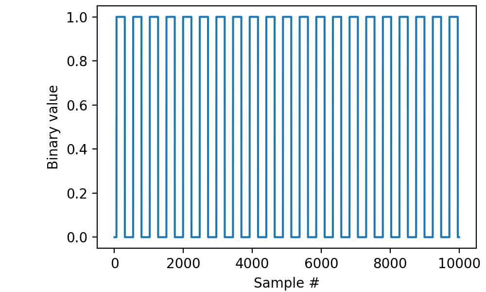
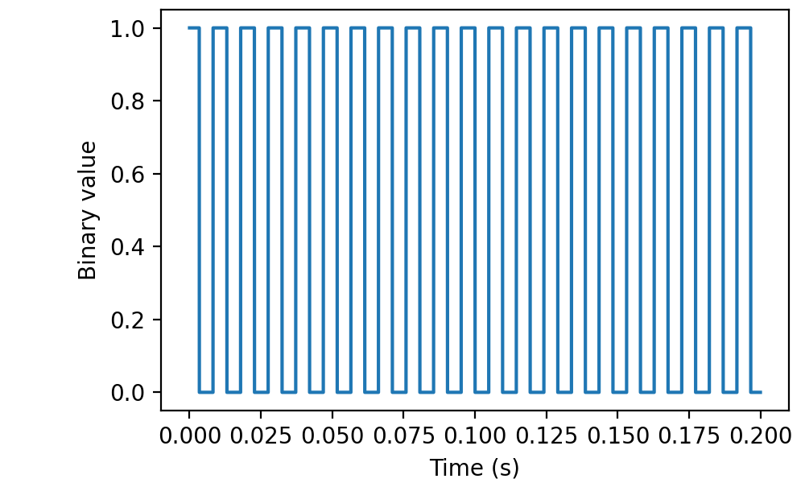
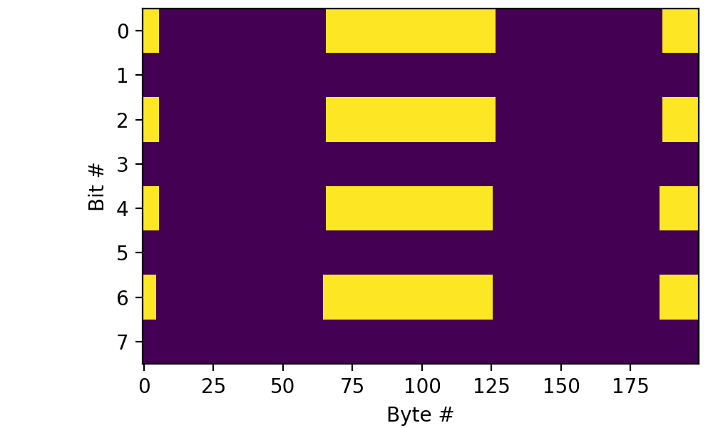

.. _cookbook-dig:

Recipes for recording from a single analog source
=================================================

Recording a short segment from a digital line
---------------------------------------------

Read 200 milliseconds worth of data from line “di0” with a sampling
frequency of 50 kilohertz and display the results using matplotlib:

.. literalinclude :: _static/code/cookbook/recipe_d1a.py

           
Retrieving timestamps
---------------------
           
The *read* function can also return timestamps along with your data:

.. literalinclude :: _static/code/cookbook/recipe_d1b.py

In this case, I had an approximately 100-Hz square TTL pulse train
connected to the input:

           
Reading a short segment from two lines
-----------------------------------------

Read 200 ms worth of data from channels “di0” and “di1” with a
sampling frequency of 50 kilohertz and display the results using
matplotlib:

.. literalinclude :: _static/code/cookbook/recipe_d2a.py

(The second line sampled a rather boring signal.)

Retrieving raw binary data
--------------------------

On occasion, e.g., for debugging purposes, it may be useful to retrieve raw binary data.

.. literalinclude :: _static/code/cookbook/recipe_d2raw.py

The result is a packed array of bytes (``np.uint8``) in which the bits
represent the interleaved data from all of the recorded lines. In this
case, bits 0, 2, 4, and 6 of each byte derive (in that order) from
line “di0” whereas bits 1, 3, 5, and 7 derive from line
“di1”. Plotting that with numpy and matplotlib involves a little
``np.unpackbits`` magic, as the above code illustrates.

Of course you could extract the two lines separately using
``np.unpackbits(data, bitorder='little').reshape(-1, 2).T``, though at
that point you might as well call ``di.read(...)`` without the `raw`
parameter set to ``True``.
