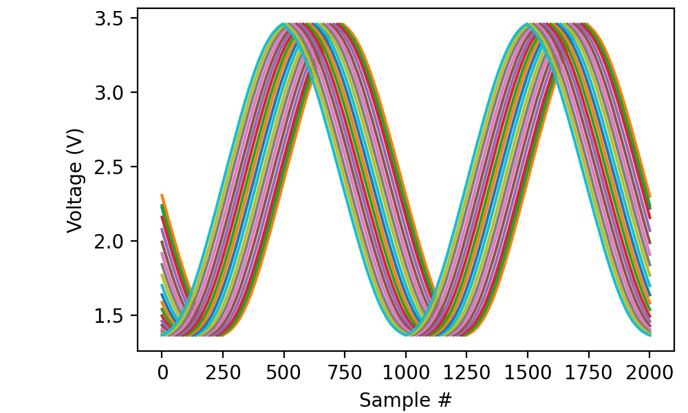

.. _cookbook-episodic:

Recipes for recording short chunks of data at regular intervals
===============================================================

Periodically recording a short chunk from an analog channel
-----------------------------------------------------------

The ``episodic(...)`` method on ``AnalogIn`` and ``DigitalIn`` may be
used to record short segments of data at fixed intervals:

.. literalinclude :: _static/code/cookbook/recipe_epi1a.py

In this case, we record 20 milliseconds, 10 times per second (i.e.,
once every 100 ms). Note the absence of an argument to the
``read(...)`` method: this implies reading precisely one episode worth
of data.

If the source frequency had been exactly 100 hertz, the recorded
signals would lie on top of one another. As it is, there is a small
systematic drift between traces:

In the real world, episodic recording has two main purposes:

1. Recording multiple channels at such a high sampling rate that the
   USB connection could not keep up;

2. Recording responses to periodic stimulation.

For use case (1), episodic recording capitalizes on not capturing data
between episodes, so the USB connection can catch up. Use case (2) is
often combined with :ref:`triggered recording <cookbook-trig>` to make
sure each episode lines up exactly with the stimulus.

Episodic recording with mixed signals
-------------------------------------
   
When combining analog with digital inputs and/or inputs with outputs,
you only need to call ``episodic(...)`` on one of the streams; the call
applies automatically to the others. For instance:

.. code-block::

    K = 20
    adata = []
    ddata = []
    with AnalogIn(channel=0, rate=100*kHz) as ai:
        with DigitalIn(line=0, rate=100*kHz) as di:
            ai.episodic(duration=20*ms, period=100*ms)
            for k in range(K):
                adata.append(ai.read())
                ddata.append(di.read())

This simultaneously reads from “ai0” and “di0” for 20 ms out of every 100 ms.
