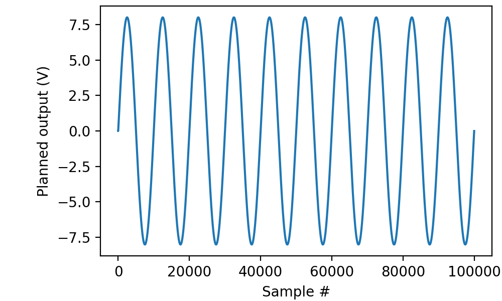
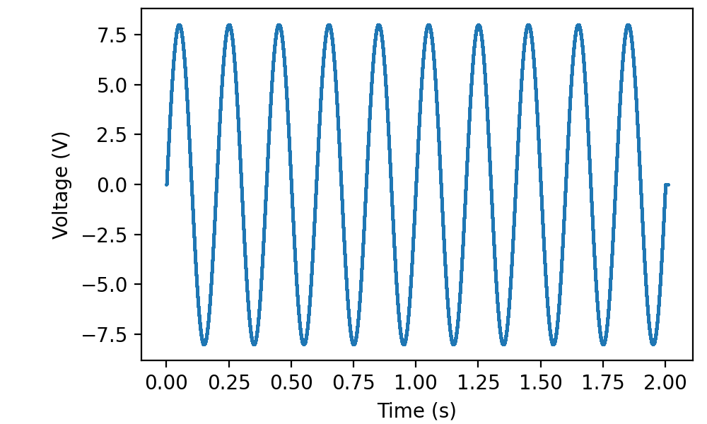

.. _cookbook-funcoutput:

Recipes for using picoDAQ as a function generator
=================================================
           
Outputting a sine wave
----------------------

Like advanced traditional function generators, PicoDAQ can store
arbitrary waveforms, and this is the most convenient way to produce
sine wave output. The first step is to define the sine wave itself
with a little numpy magic:

.. literalinclude :: _static/code/cookbook/recipe_fo2a.py

This defines a 5-Hz sine wave for use at 50-kHz
sampling rate.

After that, we can visualize what the PicoDAQ intends to output:

.. literalinclude :: _static/code/cookbook/recipe_fo2b.py

Note that the final amplitude of the sine wave is defined by the
`scale` parameter to ``Wave``. As a useful convention, we defined the
core wave shape abstractly with amplitude 1. That way we can keep
track of physical units, despite the fact that numpy does not store
them in its vectors.

Actually sending this wave to the PicoDAQ uses the exact same code as
for :ref:`pulse output <cookbook-pulseoutput>`. In fact, from the
perspective of PicoDAQ, function generator output is just pulse output
with pulse period equal to pulse duration.

.. literalinclude :: _static/code/cookbook/recipe_fo2c.py

(As before, I connected a cable between ao0 and ai0 to record the signal.)

Naturally, wave shapes other than sines are equally possible. The only
restriction is on the total number of samples in all waves
simultaneously stored in the picoDAQ’s onboard memory. (If that
restriction bites, consider using :ref:`continuously sampled output
<cookbook-sampleout>`.
