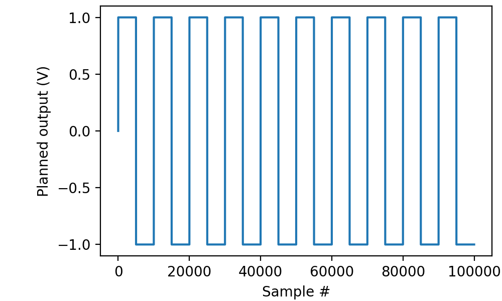
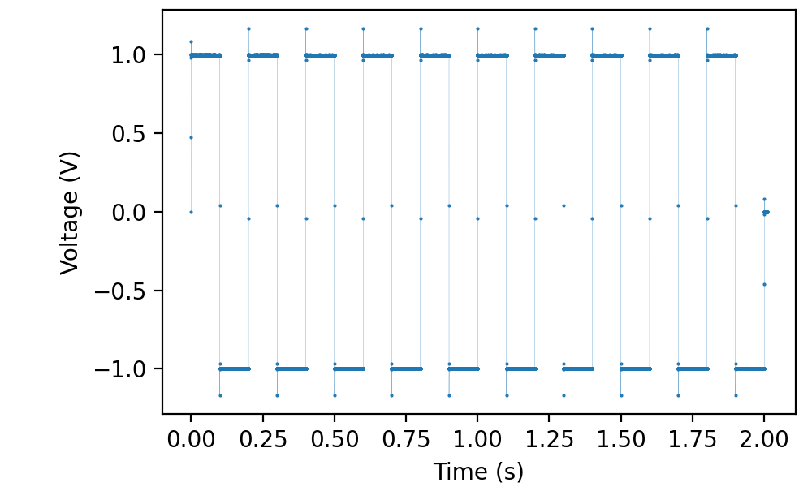

.. _cookbook-funcoutput1:

Using picoDAQ as a function generator
=====================================

Outputting a continuous square wave
-----------------------------------

To output a continuous square wave with amplitude 1 V from baseline
(i.e., 2 V peak-to-peak) with each phase of the wave lasting 10 ms
(i.e., frequency 50 Hz considering that there are two phases):

.. literalinclude :: _static/code/cookbook/recipe_fo1a.py

This outputs to channel ao0.

To visualize the programmed outputs before actually sending them on:

.. literalinclude :: _static/code/cookbook/recipe_fo1b.py

           

PicoDAQ can simultaneously record, so if you connect a BNC cable
between ao0 and ai0, we can verify that the output is indeed as
advertised:

.. literalinclude :: _static/code/cookbook/recipe_fo1c.py

           

Outputting a sine wave
----------------------

