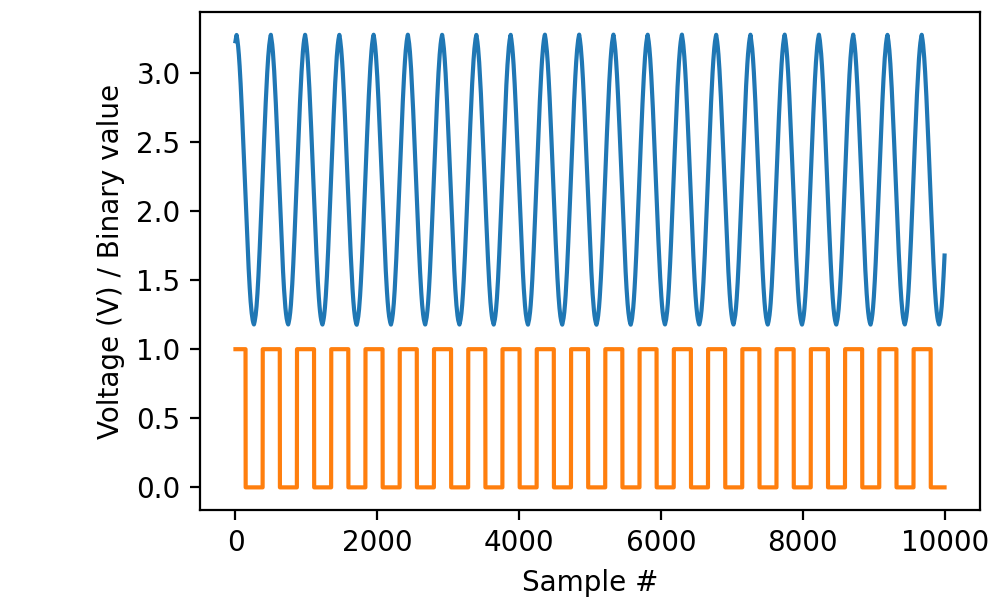
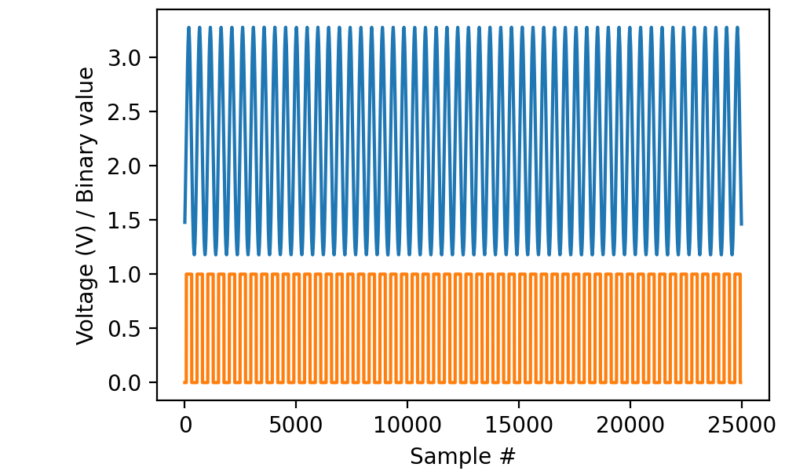

.. _cookbook-mix:

Recipes for recording simultaneously from analog and digital sources
====================================================================

Recording a short segment from an analog channel and a digital line
-------------------------------------------------------------------

Read 200 milliseconds worth of data from channel “ai0” and line “di0”
of the same device with a sampling frequency of 50 kilohertz and
display the results using matplotlib:

.. literalinclude :: _static/code/cookbook/recipe_mix1a.py

Even though you call the ``read(...)`` functions on the two streams
one after the other, the data are in fact sampled simultaneously. (The
library performs the necessary buffering behind the scenes.)

Note the convention that analog sources connect to “channels” whereas
digital sources connect to “lines”. Also note that the sampling rate
for analog and digital must be the same. In fact, as we will see in
the next example, it is OK to specify the ``rate=...`` parameter only
in the first stream to be opened and leave it implicit when opening
the other.

           
Recording more data
-------------------

When reading multiple segments in sequence, there is no requirement to
take equal sips from the analog and digital streams, but doing so
makes your code a lot easier to read:

.. literalinclude :: _static/code/cookbook/recipe_mix1b.py

In all cases, sampling starts at the time of the first ``read(...)`` call to
either stream.

Retrieving timestamps
---------------------

Timestamps retrieved from either stream are valid for the other
stream, so you could write:

.. code-block::

    with AnalogIn(channel=0, rate=50*kHz) as ai:
        with DigitalIn(line=0, rate=50*kHz) as di:
            adata, times = ai.read(200*ms, times=True)
            ddata = di.read(200*ms)

and use the ``times`` variable when plotting the ``ddata``.

Recording from multiple channels and multiple lines
---------------------------------------------------

There are no restrictions as to how many analog channels and digital
lines can be read simultaneously, as long as you respect the maximum
total throughput of the USB connection. Code like:

.. code-block::
   
    with AnalogIn(channels=[0, 1], rate=50*kHz) as ai:
        with DigitalIn(lines=[0, 1], rate=50*kHz) as di:
            adata = ai.read(200*ms)
            ddata = di.read(200*ms)

works as you would expect. Equally, it is OK to use `channels` with
``AnalogIn`` while using `line` with ``DigitalIn`` or the converse.
