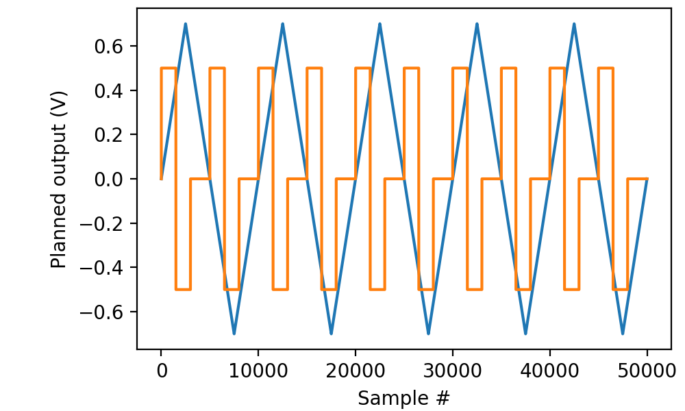
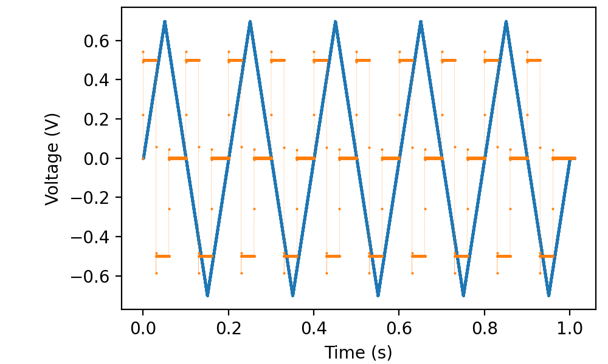
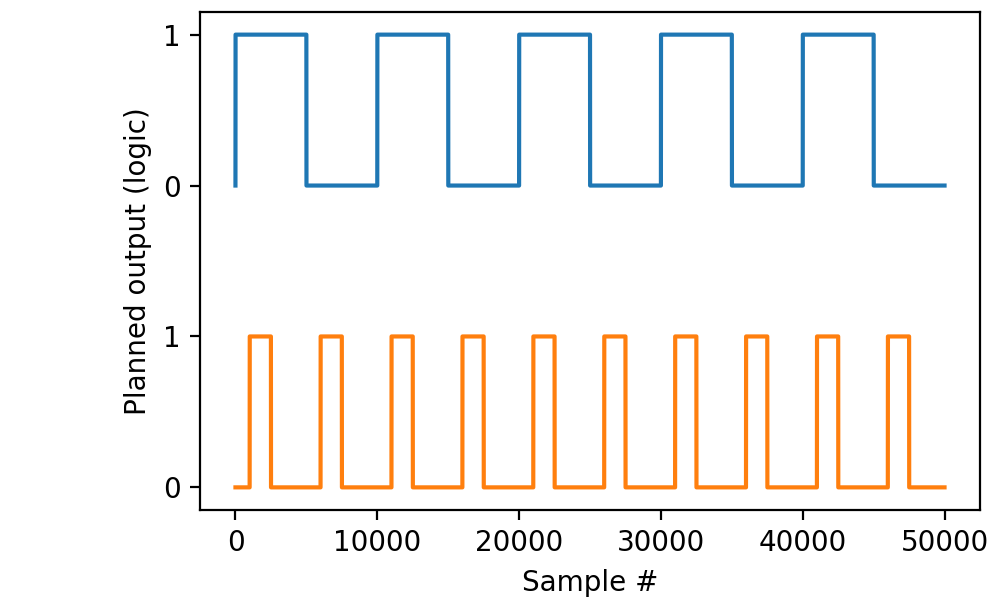
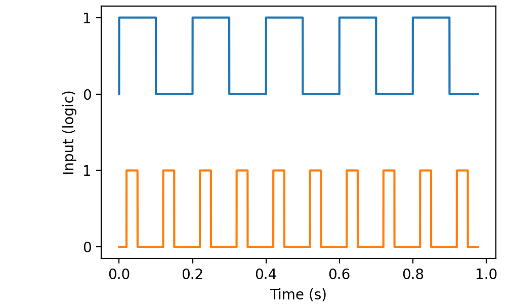
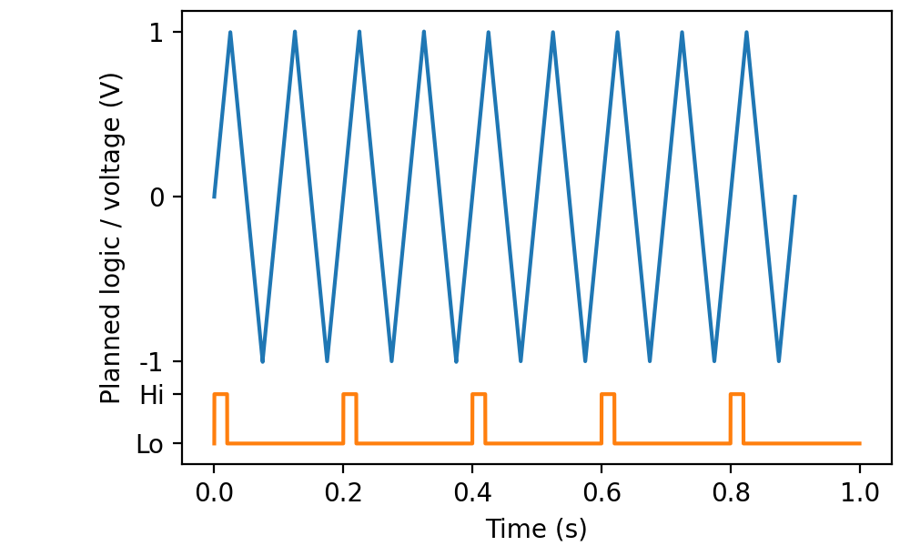
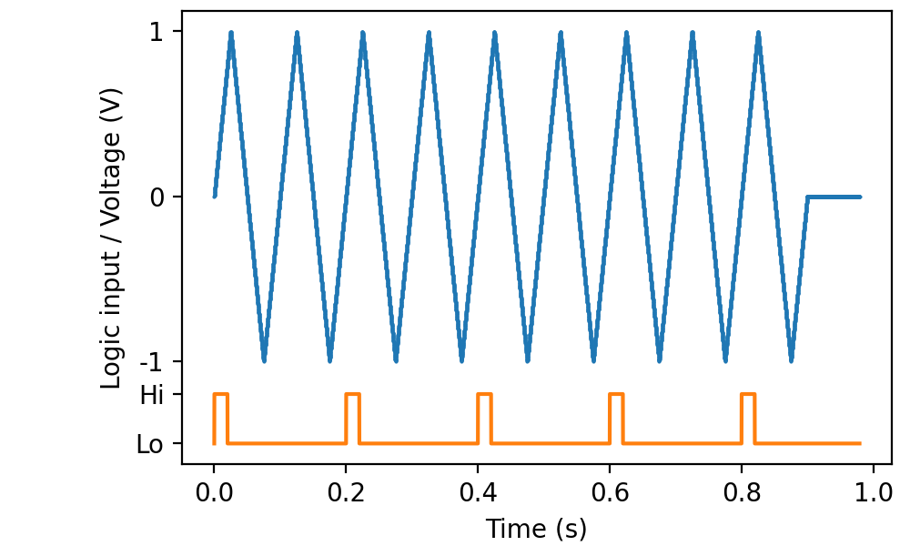
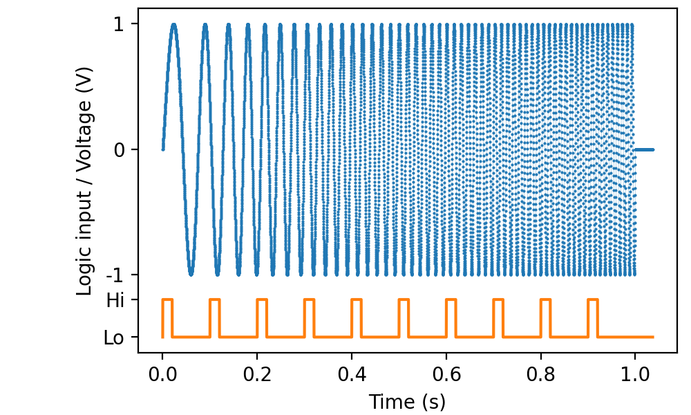

.. _cookbook-output2:

Recipes for simultaneously generating multiple outputs
======================================================

Simultaneously outputting two analog pulse sequences
----------------------------------------------------

Simultaneously generating output on two channels is done by assigning
a stimulus to each of them:

.. literalinclude :: _static/code/cookbook/recipe_to1a.py

Visualizing these before sending them out is done separately:

.. literalinclude :: _static/code/cookbook/recipe_to1b.py

As always, we can combine this with analog input to verify that the generated signals are as expected:

.. literalinclude :: _static/code/cookbook/recipe_to1c.py

where I connected ao1 to ai1 in addition to connecting ao0 to ai0.

           
Simultaneously outputting two digital pulse sequences
-----------------------------------------------------

In perfectly analogous way, we can send data to multiple digital
outputs simultaneously:

.. literalinclude :: _static/code/cookbook/recipe_to2a.py

and visualize the stimulation plan before actually generating physical output:

.. literalinclude :: _static/code/cookbook/recipe_to2b.py

By connecting do0 to di0 and do1 to di1, we can verify that the output
is as expected:

.. literalinclude :: _static/code/cookbook/recipe_to2c.py

           
Simultaneous analog and digital output
--------------------------------------

Mixing parametrized analog and digital outputs is done by creating
both ``AnalogOut`` and ``DigitalOut`` objects. As usual, we begin by
visualizing the planned pulse sequences:

.. literalinclude :: _static/code/cookbook/recipe_mo1a.py

We ask for ``times`` to be returned from both ``mockstim`` calls,
because there is no assumption that the sequences are the same length.

Then we connect do0 to di0 and ao0 to ai0 to verify that the output
is as expected:         
           
.. literalinclude :: _static/code/cookbook/recipe_mo1c.py

PicoDAQ automatically records for as long as needed to cover the
longest of the stimulus sequences:

Mixing sampled and parametrized output
--------------------------------------

There is no limit on what types of output can be combined. For
instance, to combine the earlier frequency sweep with digital markers,
we could set up the stimuli with:

.. literalinclude :: _static/code/cookbook/recipe_mo2a.py

Then we connect do0 to di0 and ao0 to ai0 to verify that the result
is as expected:         
           
.. literalinclude :: _static/code/cookbook/recipe_mo2c.py

