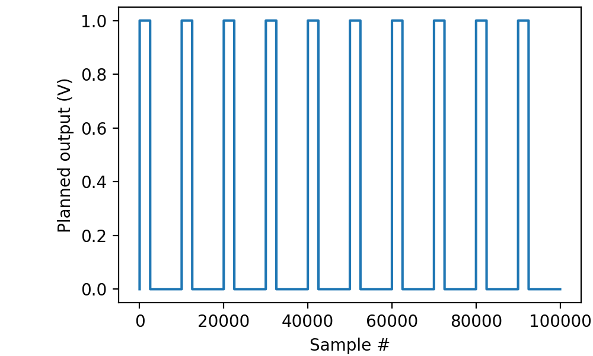
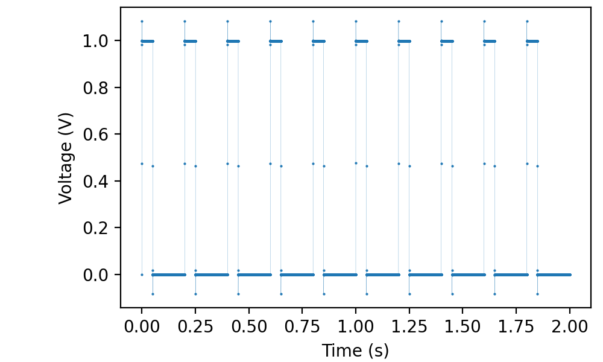
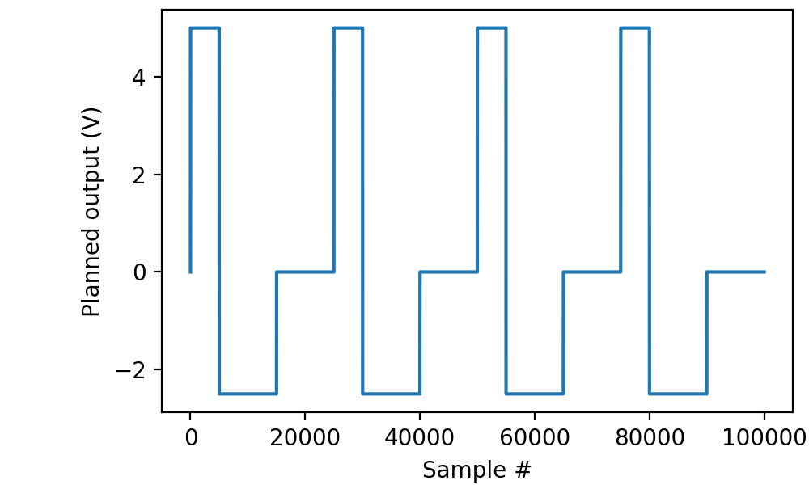
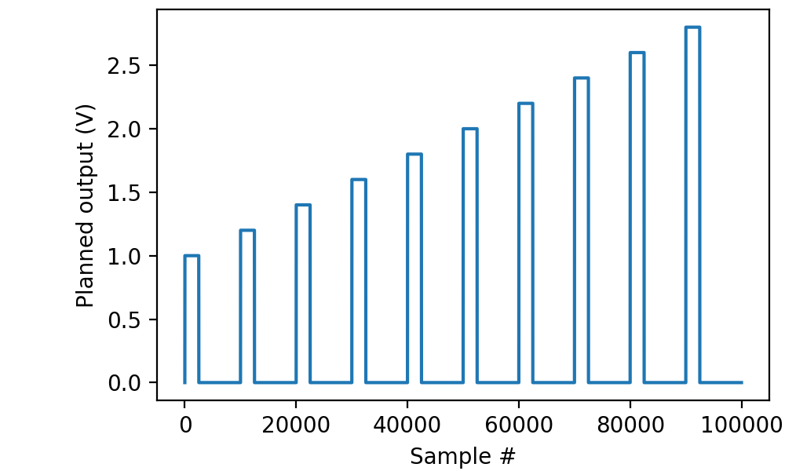
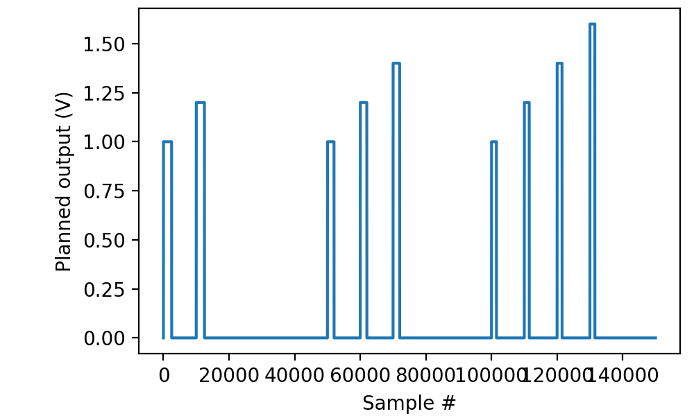
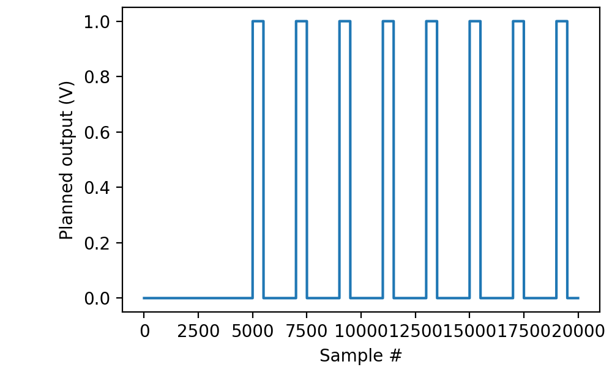
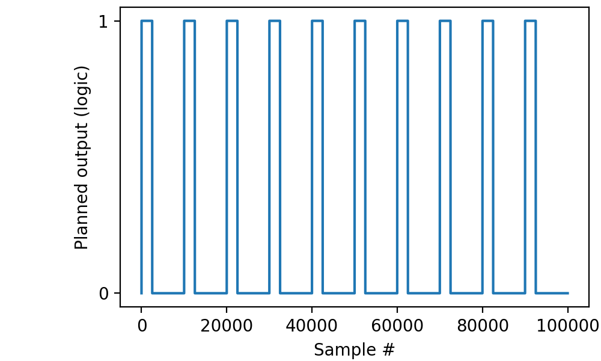

.. _cookbook-pulseoutput:

Using picoDAQ as a pulse generator
==================================

Outputting a sequence of pulses
-------------------------------

To output a sequence of monophasic square pulses:

.. literalinclude :: _static/code/cookbook/recipe_po0a.py

This outputs 10 pulses with amplitude 1 V and duration 50 ms to ao0,
at a repetition rate of 5 Hz (programmed here as a period of 200 ms).

Often it is desirable to visualize the programmed pulse train before
actually sending it out:

.. literalinclude :: _static/code/cookbook/recipe_po0b.py

Because PicoDAQ can simultaneously record and stimulate, we can
readily verify that the output is indeed as advertised, by running the
following code while a BNC cable connects ao0 to ai0:

.. literalinclude :: _static/code/cookbook/recipe_po0c.py

(Note the single-sample overshoots as the hardware attempts to make
the sharpest possible square waves.)

The act of reading from the input stream (``ai.read(...)``)
automatically starts the output. Almost the same effect could be
obtained with

.. code-block ::

    with AnalogOut(rate=50*kHz) as ao:
            with AnalogIn(channel=0) as ai:
                ao[0].stimulus(train)
                ao.run()
                data, times = ai.readall(times=True)

except that this causes the acquisition to end immediately after the
end of the final pulse.
                
Outputting pulses of different shapes
-------------------------------------

PicoDAQ can output pulses of a variety of shapes. For instance, here
is how to generate asymmetric biphasic pulses:

.. literalinclude :: _static/code/cookbook/recipe_po2a.py

Again, we can visualize the pulses before actually generating output:

.. literalinclude :: _static/code/cookbook/recipe_po2b.py

Outputting a sequence of pulses of increasing amplitude
-------------------------------------------------------

In the above examples, all of the pulse within a train were
identical. PicoDAQ also allows us to vary them in a systematic
fashion, for instance, increasing the amplitude by a constant amount
for each subsequent pulse:

.. literalinclude :: _static/code/cookbook/recipe_po1a.py

resulting in a stimulus sequence like this:

Outputting a sequence of trains with increasing pulse counts
------------------------------------------------------------

Instead of a single train, PicoDAQ also allows us to define stimuli
that comprise a series of trains, in which case it is possible to
systematically vary parameters between trains:

.. literalinclude :: _static/code/cookbook/recipe_po3a.py

resulting in a stimulus sequence like this:

Note that both parameters pertaining to trains (e.g., the pulse count)
and pertaining to the consituent pulses (e.g., the pulse duration) can
be changed between trains. It is permissible to change a parameter
both on a per-train and a per-pulse basis, in which case the changes
are applied cumulatively.

Delaying the start of stimulation
---------------------------------

Whether applying a single pulse, a train, or a series of trains, the
start of stimulation may be delayed relative to the start of the run
using the `delay` parameter to ``stimulus(...)``: 

.. literalinclude :: _static/code/cookbook/recipe_po4a.py

The same `delay` parameter can also be passed to ``mockstim(...)``:

.. literalinclude :: _static/code/cookbook/recipe_po4b.py

           
Outputting TTL pulses to a digital output
-----------------------------------------

Unlike analog outputs, which admit a variety of pulse shapes, digital
outputs only admit a single shape, TTL:

.. literalinclude :: _static/code/cookbook/recipe_po5a.py

Trains and series of trains can be constructed for digital outputs in
the exact same way as for analog outputs, except that there are fewer
pulse shape parameters that can be varied through ``Deltas``.
