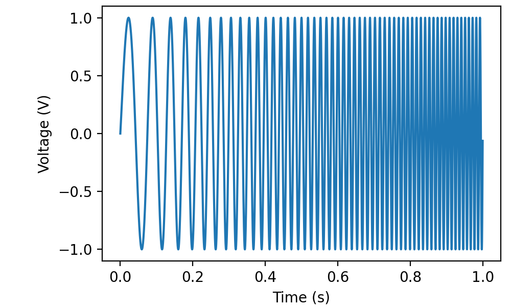
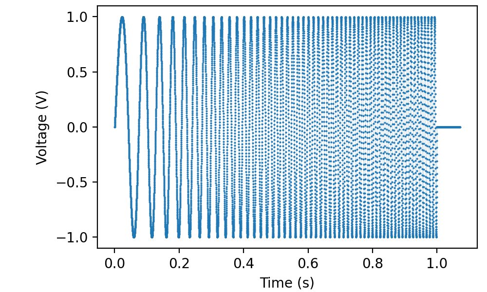
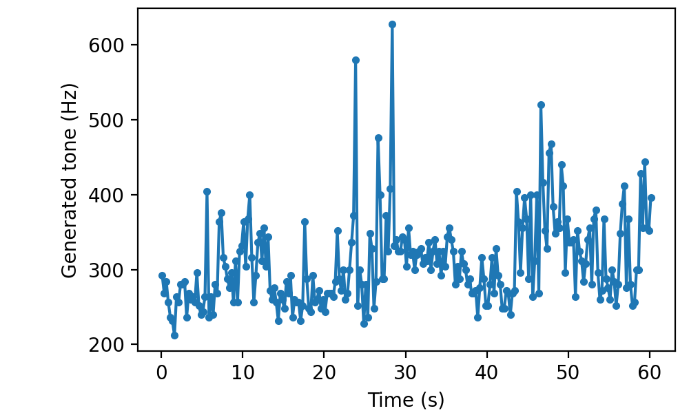
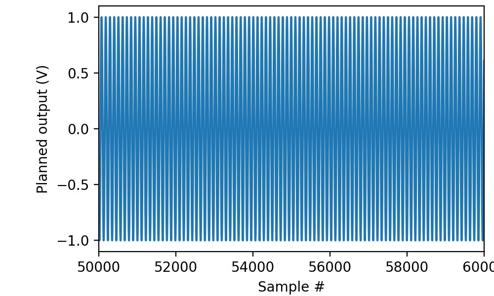

.. _cookbook-sampleout:

Nonparametric (“sampled”) output
================================

Although parametric output as considered in the previous two sections
can be very convenient, not all cases are covered. For instance,
picoDAQ’s pulse parametrization does not allow for sinusoidal
frequency sweeps. For cases like that, and when the wave duration is
too long to fit in the picoDAQ’s onboard memory, nonparametric, or
continuously sampled, output offers a solution. You have two options:
Either you precompute the entire waveform and offer it to picoDAQ in
the form of a numpy array before starting the run, or you write a
function that generates chunks of the waveform on the fly. We will
show examples of both approaches.

Precomputed waveforms
---------------------

The first step is to generate the waveform. For our example, we'll
generate a frequency sweep using scipy's ``sweep_poly`` function and inspect the result with matplotlib:

.. literalinclude :: _static/code/cookbook/recipe_so1a.py

The result can be sent to analog output channel 0 using:

.. literalinclude :: _static/code/cookbook/recipe_so1c.py

As per tradition, I connected ao0 to ai0, so we have a record of the produced waveform:

To be clear, the picoDAQ python library does not send the entire
waveform to the device at the beginning of the run, but rather in
small chunks during the run. As a consequence, the length of data that
can be output in this fashion is only limited by the amount of memory
in your computer.

Dynamic waveform generation
---------------------------

For exceedingly long waveforms, or in situations where the output has
to be adapted to external conditions, wave data can also be submitted
to picoDAQ on the fly. As a rather contrived example, the following
uses the real-time CPU frequency of your computer (as obtained by the
``psutil`` module) to modulate a sine wave:

.. literalinclude :: _static/code/cookbook/recipe_so2a.py

Note that picoDAQ automatically refills the output buffer during
``ai.read(...)``. If you don't read, you will have to call
``ao.poll()`` periodically to ensure the buffer stays filled.
           
The ``while t < 60`` line in the example makes it stop after a minute,
but picoDAQ could go on all day if you let it.  In particular, a simple::

    with AnalogOut(rate=fs) as ao:
        ao[0].sampled(produce, scale=1*V)
        ao.run()
           
would run forever.

As always, it can be useful to visualize a segment of the generated
data before sending it to the hardware:

.. literalinclude :: _static/code/cookbook/recipe_so2b.py

although in this particular case, the mockup is not entirely
realistic, because it runs much faster and therefore does not capture
a representative sample of cpu frequencies.
