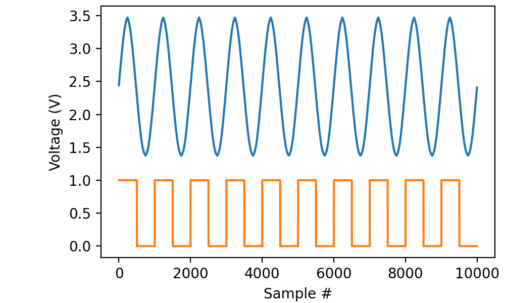
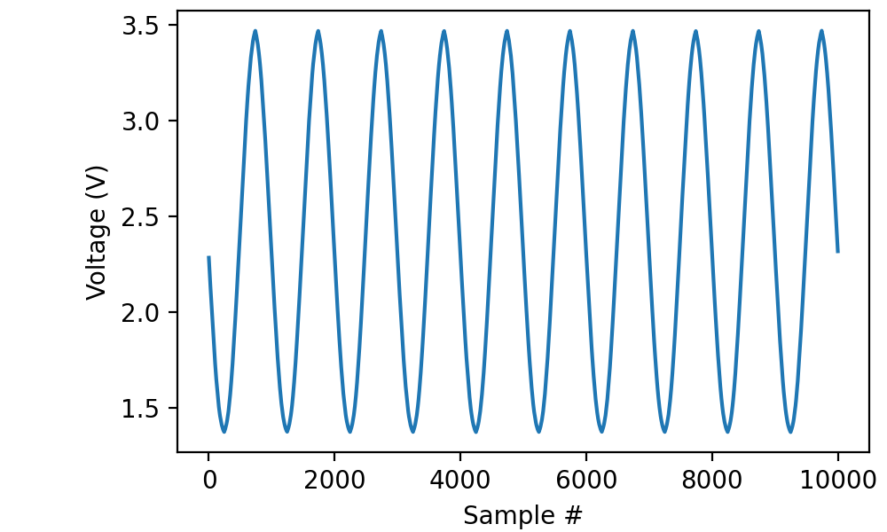
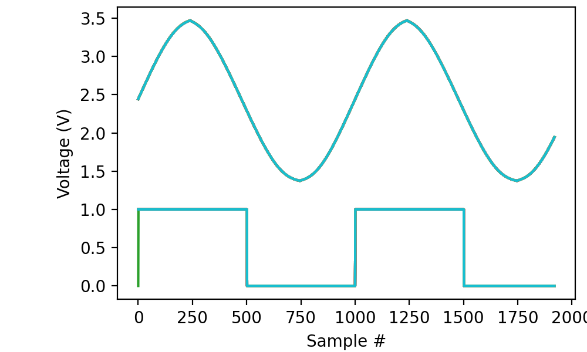

.. _cookbook-trig:

Recipes for using triggers
==========================

Using triggers to start a recording
-----------------------------------

The ``trigger(...)`` method on ``AnalogIn`` and ``DigitalIn`` may be
used to wait on a trigger condition before starting a recording:

.. literalinclude :: _static/code/cookbook/recipe_trig1a.py

In this case, we wait until digital line “di0” goes high before
recording 100 milliseconds from both “ai0” (connected to the main
output of a function generator) and “di0” (connected to the TTL gate
of the same function generator).

It is perfectly possible to trigger from a line that is not being
recorded. For instance,

.. code-block::
   
    with AnalogIn(channel=0, rate=100*kHz) as ai:
         ai.trigger(0, polarity=1)
         data = ai.read(100*ms)

works just fine.

The trigger is edge-sensitive, not level-sensitive, meaning that it
triggers on a low-to-high transition, not arbitrarily in the middle of
a “high” stretch of the input.

It is equally possible to trigger on a high-to-low transition:

.. literalinclude :: _static/code/cookbook/recipe_trig1b.py

In this case I opted not to record the digital signal, but
you can tell from the phase of the sine wave that we triggered on the
falling slope of the digital signal.

Combining triggers with episodic recording
------------------------------------------

The combination of triggers and episodic recording is particularly
powerful, as the start of each episode is delayed until the trigger
condition is met.

.. literalinclude :: _static/code/cookbook/recipe_trig1c.py

This captures 20 episodes of 19 milliseconds each. Each episode is
triggered by the rising edge of the TTL signal from the function
generator. As a consequence, all of the traces lie right on top of
each other, neatly revealing that my old function generator produces
ugly but consistent sine waves:

In the example above, I set *period* to zero, because I was happy
to start the next episode on the first trigger after completing the
previous episode. It is also allowed to set *period* to a larger
value, to implement a “cooldown” period. E.g., ``period=1*s`` would
ensure that the episodes are at least one second apart.
